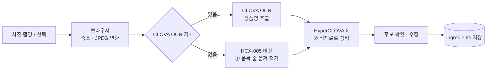

# 릿톤 — 냉장고 재료 관리 & HyperCLOVA X 레시피 추천

냉장고 속 재료의 소비기한을 관리하고, **HyperCLOVA X**로 남은 재료를 활용하는 레시피를 추천받는 모바일 웹 앱입니다.
소비기한이 지난 재료는 올바르게 버리는 방법을 안내하고, 커뮤니티에서 식재료 낭비를 줄인 경험을 서로 나눌 수 있습니다.

## 주요 기능

| 화면 | 기능 | HyperCLOVA X |
|---|---|:---:|
| 재료 | 재료 목록·상세, 수량·보관방법·소비기한(캘린더) 수정, 지난 재료 알림 배너 | |
| 영수증 스캔 | 카메라/앨범으로 영수증을 찍으면 식재료 후보를 자동으로 만들어 한 번에 등록 | ✅ |
| 레시피 | 내 레시피(재료 보유율 표시), 소비기한 임박 재료로 레시피 추천, 저장·삭제 | ✅ |
| 처리 안내 | 소비기한 지난 재료의 부위·포장재별 분리배출 방법, "버렸어요" 기록, 곧 지나는 재료 안내 | ✅ |
| 커뮤니티 | 낭비 줄인 방법 공유, 댓글·공감·검색, "내 냉장고 재료" 필터, 글 다듬기 | ✅ |
| 내 정보 | 재료 현황, 버린 재료 통계, 커뮤니티 프로필, HyperCLOVA X 연결 테스트 | |

## 시스템 아키텍처


- **클라이언트**: 브라우저에서 동작하는 단일 HTML/JS 화면입니다(서버가 `/`에서 함께 제공). 영수증 사진은 업로드 전에 브라우저에서 크기를 줄이고 JPEG로 바꿉니다.
- **서버**: `app/main.py` 하나로 된 FastAPI 앱입니다. 모든 기능은 `/api/*` JSON API로 제공됩니다.
- **HyperCLOVA X**: CLOVA Studio의 **HCX-005**를 사용합니다. 텍스트 요청은 v3 Chat Completions, 이미지 요청은 v3 → OpenAI 호환 API 순서로 자동 전환합니다.
- **데이터**: SQLite 파일 `app/littone.db` 하나에 재료·레시피·처리 기록·커뮤니티 데이터를 저장합니다.
- **폴백**: HyperCLOVA X 호출이 실패해도 앱이 멈추지 않도록 기능마다 기본 동작(기본 레시피, 분리배출 기본 규칙 등)을 둡니다. 실패 원인은 화면과 터미널에 표시됩니다.

### 영수증 → 재료 등록 흐름



이미지 요청은 `v3 + base64` → `v3 + data URI` → `OpenAI 호환 API` 순서로 시도하고, 성공한 방식을 기억해 다음부터 바로 사용합니다.

## HyperCLOVA X 연동

| # | 기능 | API | 하는 일 | 실패 시 |
|:-:|---|---|---|---|
| 1 | 영수증 품목 읽기 | `POST /api/receipt` | HCX-005 비전으로 사진에서 상품 줄만 옮겨 적기 | 오류 안내 |
| 2 | 식재료 정리 | `POST /api/receipt` | 상품명 → 재료명·개수·보관방법·소비기한 일수(JSON) | 상품명 단순 정리 |
| 3 | 레시피 추천 | `GET /api/recommend` | 소비기한 임박 재료를 우선 사용한 레시피(JSON) | 보유율이 가장 높은 기본 레시피 |
| 4 | 분리배출 안내 | `GET /api/disposal` | 부위·포장재별 배출 방법, 주의사항, 보관 팁. 결과는 DB에 캐시 | 환경부 기준 기본 규칙 |
| 5 | 커뮤니티 글 정리 | `POST /api/community/posts`, `/polish` | 제목·분류·재료 태그 자동 생성, 욕설·광고·개인정보 필터, 글 다듬기 | 단순 태그, 전화번호 필터 |

- 같은 재료의 분리배출 안내는 한 번 만든 뒤 `disposal_guides` 테이블에서 다시 쓰므로 토큰을 아낄 수 있습니다.
- 연결 확인: 앱의 **내 정보 → 연결 테스트**, 또는 `GET /api/status?ping=true`

## 실행 방법

```bash
cd limithackathon
python3 -m venv .venv
source .venv/bin/activate          # Windows: .venv\Scripts\activate
pip install -r requirements.txt
python app/main.py                 # → http://localhost:8000
```

같은 Wi‑Fi의 다른 기기에서는 `http://<내 IP>:8000`으로 접속합니다(macOS에서 IP 확인: `ipconfig getifaddr en0`).
카메라 미리보기는 `localhost`(또는 HTTPS)에서만 켜지고, 그 외 주소에서는 사진 선택 창이 열립니다.

## 환경변수 (`app/.env`)

```
CLOVASTUDIO_API_KEY=nv-xxxxxxxxxxxxxxxx   # CLOVA Studio API 키 (NAVER_API_KEY 이름도 인식)
# CLOVASTUDIO_MODEL=HCX-005               # 텍스트 작업 모델 (기본 HCX-005)
# CLOVASTUDIO_VISION_MODEL=HCX-005        # 영수증 이미지 인식 모델 (이미지 입력 가능 모델)
# CLOVA_OCR_INVOKE_URL=...                # (선택) CLOVA OCR — 둘 다 넣으면 영수증 1단계를 OCR로
# CLOVA_OCR_SECRET_KEY=...
```

`app/.env`는 `.gitignore`에 포함되어 있어 저장소에 올라가지 않습니다.

## API

| 구분 | 메서드 · 경로 | 설명 |
|---|---|---|
| 재료 | `GET/POST /api/ingredients`, `POST /api/ingredients/bulk` | 목록·추가·여러 개 추가 |
| | `GET/PATCH/DELETE /api/ingredients/{id}` | 상세·수정·삭제 |
| | `POST /api/ingredients/{id}/dispose` | "버렸어요" — 삭제 후 처리 기록 저장 |
| 영수증 | `POST /api/receipt` (multipart `file`) | 영수증 → 식재료 후보 |
| 레시피 | `GET/POST /api/recipes`, `GET/DELETE /api/recipes/{id}` | 목록·저장·상세·삭제(기본 레시피는 삭제 불가) |
| | `GET /api/recommend` | HyperCLOVA X 레시피 추천 |
| 처리 안내 | `GET /api/disposal?id=` | 지난 재료 + 분리배출 안내, 곧 지나는 재료 |
| | `GET /api/stats` | 버린 재료 통계 |
| 커뮤니티 | `GET/POST /api/community/me` | 닉네임·프로필 |
| | `GET /api/community/posts?category=&sort=&q=&fridge=` | 피드(분류·정렬·검색·내 냉장고 재료) |
| | `POST /api/community/posts`, `GET/DELETE /api/community/posts/{id}` | 글쓰기·상세·삭제 |
| | `POST /api/community/posts/{id}/like`, `.../comments` | 공감 토글·댓글 |
| | `DELETE /api/community/comments/{id}`, `POST /api/community/polish` | 댓글 삭제·글 다듬기 |
| 상태 | `GET /api/status?ping=true` | API 키·모델 설정 확인, 실제 호출 테스트 |

FastAPI 자동 문서: `http://localhost:8000/docs`

## 데이터 모델 (`app/littone.db`)

| 테이블 | 내용 |
|---|---|
| `ingredients` | 재료명, 개수, 보관방법, 소비기한, 메모 |
| `recipes` | 레시피명, 조리시간, 재료, 조리 단계, 출처(`seed` 기본 / `hcx` 저장) |
| `disposed` | 버린 재료 기록(날짜, 소비기한 지난 일수) |
| `disposal_guides` | 재료별 분리배출 안내 캐시(HyperCLOVA X 결과) |
| `users`, `posts`, `likes`, `comments` | 커뮤니티 사용자·글·공감·댓글 |

DB는 서버를 처음 실행할 때 자동으로 만들어지고 예시 재료·기본 레시피·공식 팁이 들어갑니다. 초기화하려면 서버를 끄고 `app/littone.db`를 지우면 됩니다.

## 폴더 구조

```
limithackathon/
├── app/
│   ├── main.py          # FastAPI 서버 + 화면(HTML/CSS/JS) 전체
│   ├── .env             # API 키 (Git 제외)
│   └── littone.db       # SQLite DB (자동 생성, Git 제외)
├── docs/
│   ├── architecture.svg # 아키텍처 다이어그램
│   └── architecture.png
├── requirements.txt
└── README.md
```

## 알려진 한계

- 커뮤니티는 로그인 없이 브라우저마다 만든 ID와 닉네임으로 사용자를 구분합니다(해커톤용). 브라우저 데이터를 지우면 내 글의 삭제 권한이 사라집니다.
- 냉장고 재료는 사용자별이 아니라 서버 하나에 하나입니다.
- 재료·요리 이미지는 사진 대신 이모지로 표시합니다.
- 분리배출 세부 기준은 지역마다 다를 수 있어 앱에서도 해당 지자체 안내를 확인하도록 안내합니다.
