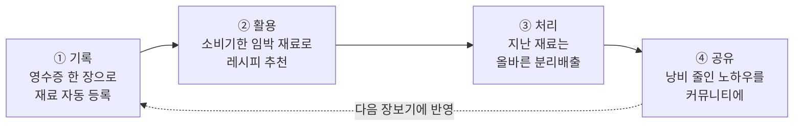
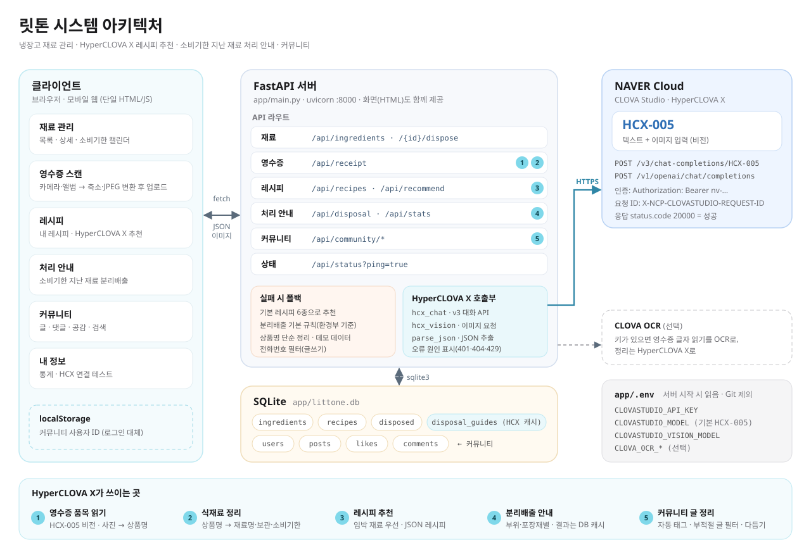
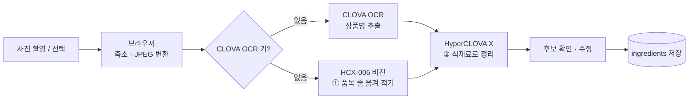

# 릿톤 — 냉장고 속 낭비를 줄이는 HyperCLOVA X 앱

> **HyperCLOVA X 해커톤 (2026.10)** · 주제: **"일상생활에서 낭비를 어떻게 줄일 수 있을까?"**
> 팀마다 제한된 토큰(50만 원 상당)의 네이버 **HyperCLOVA X**만으로 만든 프로젝트입니다.

장을 보고, 잊어버리고, 소비기한이 지나 버리고, 그마저 잘못 버리는 일. 집에서 생기는 음식 낭비는 대부분 이 흐름에서 생깁니다.
**릿톤**은 이 과정을 **기록 → 활용 → 처리 → 공유**의 4단계로 끊어서, 냉장고 속 식재료가 버려지기 전에 다 먹고, 어쩔 수 없이 버릴 때는 올바르게 버리도록 돕습니다.
그리고 해커톤의 또 다른 조건이었던 **제한된 토큰**도 낭비하지 않도록 설계했습니다.

---

## 낭비를 줄이는 4단계



| 단계 | 생기는 낭비 | 릿톤이 하는 일 | HyperCLOVA X |
|---|---|---|:---:|
| **① 기록** | 무엇을 샀는지 잊고, 있는 재료를 또 삼 | 영수증을 찍으면 상품명을 읽어 **식재료·보관방법·소비기한**까지 정리해 한 번에 등록. 모든 재료에 D-day 표시 | ✅ |
| **② 활용** | 소비기한을 놓쳐 멀쩡한 재료를 버림 | **소비기한이 임박한 재료부터** 쓰는 레시피를 추천하고, 재료 보유율을 보여줌 | ✅ |
| **③ 처리** | 지난 재료를 잘못 버림(음식물/일반 혼동) | 재료의 **부위·포장재별 분리배출 방법**을 안내하고, 버린 기록과 통계를 남겨 다음 장보기를 돌아보게 함 | ✅ |
| **④ 공유** | 좋은 보관·활용법이 나만 알고 끝남 | 커뮤니티에서 낭비 줄인 경험을 공유. **내 냉장고 재료와 관련된 글**만 모아 보기, 대충 쓴 글을 다듬어 주기 | ✅ |

## 토큰도 낭비하지 않았습니다

토큰이 제한된 해커톤이었기 때문에, HyperCLOVA X는 **꼭 필요한 곳에만, 필요한 만큼만** 부르도록 만들었습니다.

| 방법 | 내용 |
|---|---|
| **결과 캐시** | 재료별 분리배출 안내는 한 번 생성하면 DB(`disposal_guides`)에 저장하고, 같은 재료는 다시 호출하지 않음 |
| **묶어서 호출** | 소비기한 지난 재료가 여러 개여도 한 번의 요청으로 안내를 받음(최대 8개) |
| **출력 길이 제한** | 작업마다 `maxTokens`를 따로 지정 (태그 300 · 글 다듬기 600 · 영수증 인식 1024 · 레시피 2048 · 분리배출 3500 · 연결 테스트 20) |
| **JSON 출력 고정** | 응답 형식을 JSON으로 지정하고 견고하게 파싱해서, 형식 오류로 다시 부르는 일을 줄임 |
| **불필요한 재시도 차단** | 이미지 전송 방식은 성공한 방식을 기억해 다음부터 바로 사용. 키 오류·호출 한도 초과(401·403·429)는 재시도하지 않고 즉시 중단 |
| **요청 크기 축소** | 영수증 사진은 업로드 전에 브라우저에서 줄이고 JPEG로 변환 |
| **폴백** | 호출이 실패하면 다시 부르는 대신 기본 레시피·분리배출 기본 규칙으로 동작 |
| **토큰 없이 시작** | 기본 레시피 6종과 커뮤니티 공식 팁은 미리 넣어 두어 첫 화면에 토큰을 쓰지 않음 |
| **사용량 확인** | 호출마다 사용한 토큰 수를 터미널에 출력 (`[HyperCLOVA X] HCX-005 OK tokens=…`) |

## 시스템 아키텍처



- **클라이언트**: 브라우저에서 동작하는 모바일 웹(단일 HTML/JS, 서버가 `/`에서 제공)
- **서버**: `app/main.py` 하나로 된 FastAPI 앱, 모든 기능은 `/api/*` JSON API
- **HyperCLOVA X**: CLOVA Studio **HCX-005** (텍스트 + 이미지). 텍스트는 v3 Chat Completions, 이미지는 v3 → OpenAI 호환 API 순서로 자동 전환
- **데이터**: SQLite 파일 `app/littone.db`
- **폴백**: 호출이 실패해도 앱이 멈추지 않고, 실패 원인은 화면과 터미널에 표시

### HyperCLOVA X가 쓰이는 곳

| # | 기능 | API | 하는 일 | 실패 시 |
|:-:|---|---|---|---|
| 1 | 영수증 품목 읽기 | `POST /api/receipt` | HCX-005 비전으로 사진에서 상품 줄만 옮겨 적기 | 오류 안내 |
| 2 | 식재료 정리 | `POST /api/receipt` | 상품명 → 재료명·개수·보관방법·소비기한 일수 | 상품명 단순 정리 |
| 3 | 레시피 추천 | `GET /api/recommend` | 소비기한 임박 재료를 우선 쓰는 레시피 | 보유율이 가장 높은 기본 레시피 |
| 4 | 분리배출 안내 | `GET /api/disposal` | 부위·포장재별 배출 방법, 주의사항, 보관 팁 (DB 캐시) | 환경부 기준 기본 규칙 |
| 5 | 커뮤니티 글 정리 | `POST /api/community/posts`, `/polish` | 제목·분류·재료 태그 자동 생성, 욕설·광고·개인정보 필터, 글 다듬기 | 단순 태그 · 전화번호 필터 |

### 영수증 → 재료 등록 흐름



글자 읽기와 식재료 정리를 두 단계로 나눠, "마늘빅프랑크 → 마늘"처럼 상품명 속 재료명을 잘못 뽑는 오류를 줄였습니다.

## 실행 방법

```bash
cd limithackathon
python3 -m venv .venv
source .venv/bin/activate          # Windows: .venv\Scripts\activate
pip install -r requirements.txt
python app/main.py                 # → http://localhost:8000
```

- 같은 Wi‑Fi의 다른 기기: `http://<내 IP>:8000` (macOS IP 확인: `ipconfig getifaddr en0`)
- 카메라 미리보기는 `localhost`(또는 HTTPS)에서만 켜지고, 그 외에는 사진 선택 창이 열립니다.
- 연결 확인: 앱의 **내 정보 → 연결 테스트**, 또는 `GET /api/status?ping=true`

### 환경변수 (`app/.env`, Git 제외)

```
CLOVASTUDIO_API_KEY=nv-xxxxxxxxxxxxxxxx   # CLOVA Studio API 키 (NAVER_API_KEY 이름도 인식)
# CLOVASTUDIO_MODEL=HCX-005               # 텍스트 작업 모델 (기본 HCX-005)
# CLOVASTUDIO_VISION_MODEL=HCX-005        # 영수증 이미지 인식 모델
# CLOVA_OCR_INVOKE_URL=...                # (선택) CLOVA OCR — 둘 다 넣으면 영수증 1단계를 OCR로
# CLOVA_OCR_SECRET_KEY=...
```

<details>
<summary><b>API 목록</b></summary>

| 구분 | 메서드 · 경로 | 설명 |
|---|---|---|
| 재료 | `GET/POST /api/ingredients`, `POST /api/ingredients/bulk` | 목록·추가·여러 개 추가 |
| | `GET/PATCH/DELETE /api/ingredients/{id}` | 상세·수정·삭제 |
| | `POST /api/ingredients/{id}/dispose` | "버렸어요" — 삭제 후 처리 기록 저장 |
| 영수증 | `POST /api/receipt` (multipart `file`) | 영수증 → 식재료 후보 |
| 레시피 | `GET/POST /api/recipes`, `GET/DELETE /api/recipes/{id}` | 목록·저장·상세·삭제(기본 레시피는 삭제 불가) |
| | `GET /api/recommend` | HyperCLOVA X 레시피 추천 |
| 처리 안내 | `GET /api/disposal?id=` | 지난 재료 + 분리배출 안내, 곧 지나는 재료 |
| | `GET /api/stats` | 버린 재료 통계 |
| 커뮤니티 | `GET/POST /api/community/me` | 닉네임·프로필 |
| | `GET /api/community/posts?category=&sort=&q=&fridge=` | 피드(분류·정렬·검색·내 냉장고 재료) |
| | `POST /api/community/posts`, `GET/DELETE /api/community/posts/{id}` | 글쓰기·상세·삭제 |
| | `POST /api/community/posts/{id}/like`, `.../comments` | 공감 토글·댓글 |
| | `DELETE /api/community/comments/{id}`, `POST /api/community/polish` | 댓글 삭제·글 다듬기 |
| 상태 | `GET /api/status?ping=true` | API 키·모델 설정 확인, 실제 호출 테스트 |

FastAPI 자동 문서: `http://localhost:8000/docs`
</details>

<details>
<summary><b>데이터 모델 · 폴더 구조</b></summary>

| 테이블 | 내용 |
|---|---|
| `ingredients` | 재료명, 개수, 보관방법, 소비기한, 메모 |
| `recipes` | 레시피명, 조리시간, 재료, 조리 단계, 출처(`seed` 기본 / `hcx` 저장) |
| `disposed` | 버린 재료 기록(날짜, 소비기한 지난 일수) |
| `disposal_guides` | 재료별 분리배출 안내 캐시(HyperCLOVA X 결과) |
| `users`, `posts`, `likes`, `comments` | 커뮤니티 사용자·글·공감·댓글 |

DB는 처음 실행할 때 자동으로 만들어집니다. 초기화하려면 서버를 끄고 `app/littone.db`를 지우면 됩니다.

```
limithackathon/
├── app/
│   ├── main.py          # ★ 실행 파일: FastAPI 서버 + 화면(HTML/CSS/JS)
│   ├── .env             # API 키 (Git 제외)
│   ├── littone.db       # SQLite DB (자동 생성, Git 제외)
│   ├── server.py        # (팀 실험 코드) 별도 서버 시안
│   └── index1~5.html, style*.css, global*.css   # (팀) 화면 디자인 시안
├── app.py               # (참고) 디버깅 전 초기 버전
├── docs/
│   ├── architecture.svg # 아키텍처 다이어그램
│   └── architecture.png
├── requirements.txt
└── README.md
```
</details>

## 한계와 다음 단계

- **사용자 구분**: 해커톤 범위에서는 로그인 대신 브라우저별 ID와 닉네임을 쓰고, 냉장고는 서버당 하나입니다. → 계정과 사용자별 냉장고
- **분리배출 기준**: 지역마다 세부 기준이 달라 앱에서도 지자체 안내 확인을 권합니다. → 지역별 기준 반영
- **낭비 데이터 활용**: 버린 기록을 이미 모으고 있어, "자주 버리는 재료는 적게 사기" 같은 장보기 조언과 소비기한 임박 알림으로 확장할 수 있습니다.
